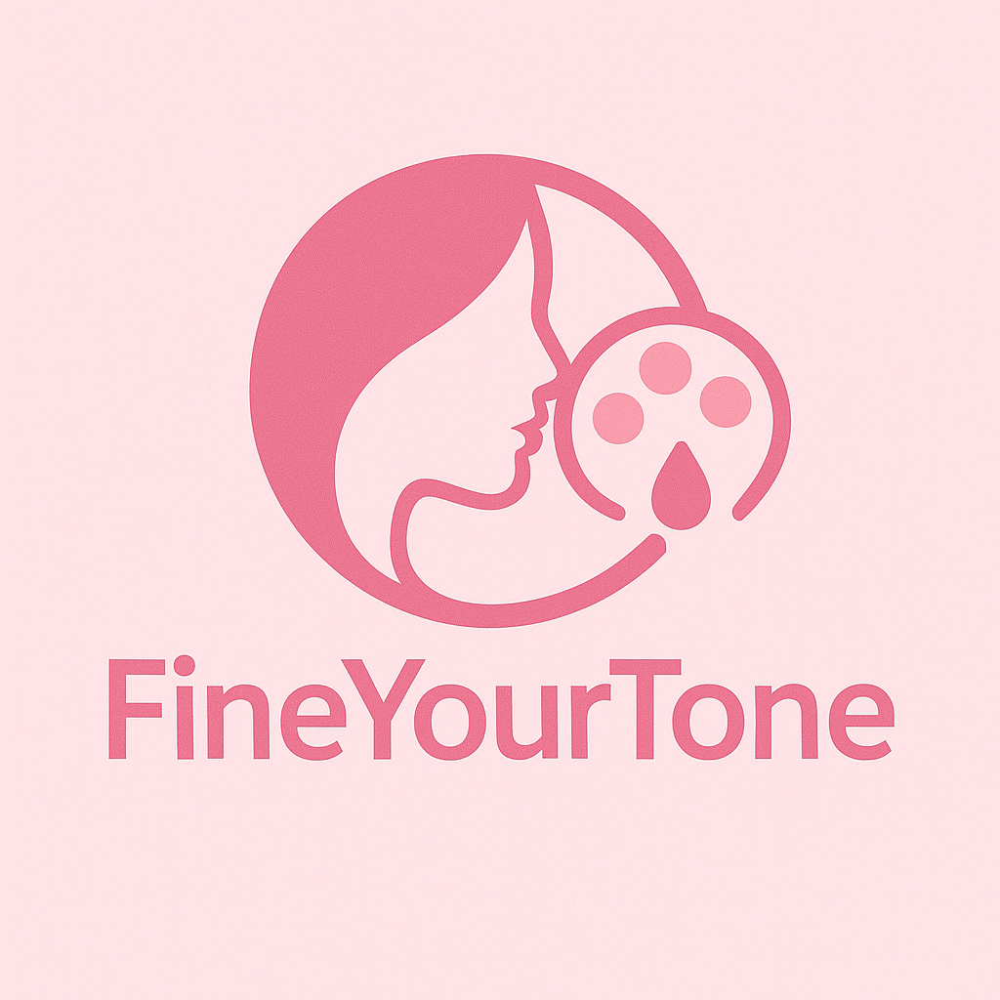

# FineYourTone - Skin Tone Detection & Color Recommendations



## About The Project

FineYourTone is an innovative web application designed to detect a user's skin tone and provide personalized color recommendations that match their complexion perfectly. This project was developed as part of the Dicoding Camp Capstone Project, powered by DBS Foundation.

### Key Features

- **Skin Tone Detection**: Upload your photo and our AI will analyze your skin tone
- **Personalized Color Recommendations**: Get clothing, makeup, and accessory color recommendations that complement your skin tone
- **Explore Undertones**: Learn about different undertones and how they affect color choices
- **User Feedback System**: Share your experience to help us improve

## Tech Stack

### Backend
- Python 3.x
- Flask
- PyTorch & TorchVision (for AI model)
- SQLite (for feedback storage)

### Frontend
- Vue.js 3
- Vite
- AOS (Animate on Scroll)
- GSAP (animations)

## Installation & Setup

### Prerequisites
- Python 3.8 or higher
- Node.js 14.x or higher
- npm or yarn

### Backend Setup

1. Clone the repository
```bash
git clone https://github.com/yourusername/Capstone_FineYourTone.git
cd Capstone_FineYourTone
```

2. Install Python dependencies
```bash
pip install -r requirements.txt
```

The backend server will start at `http://localhost:5000`.

### Frontend Setup

1. Navigate to the Vue frontend directory
```bash
cd vue-frontend
```

2. Install Node.js dependencies
```bash
npm install
# or
yarn
```

3. Start the development server
```bash
npm run dev
# or
yarn dev
```

The frontend will be available at `http://localhost:5173`.

## Usage Guide

1. **Home Page**: Learn about the application and its features
2. **Testing**: Upload your photo to detect your skin tone
3. **Explore Skintone**: Learn about different undertones and matching colors
4. **User Feedback**: Share your experience with the application

## How It Works

1. The user uploads a photo through the web interface
2. Our AI model (based on Faster R-CNN) processes the image to identify skin regions
3. The model analyzes the skin tone and determines the undertone
4. Based on the detected skin tone, the application provides personalized color recommendations

## Contributing

Contributions are welcome! Please feel free to submit a Pull Request.

## License

This project is licensed under the MIT License - see the LICENSE file for details.

## Acknowledgements

- Dicoding Academy for the learning platform and mentorship
- DBS Foundation for powering this initiative
- All team members who contributed to this project

## Contact

For any questions or feedback, please contact us through:
- GitHub Issues
- Feedback form in the application

---

&copy; 2025 FineYourTone. All rights reserved.